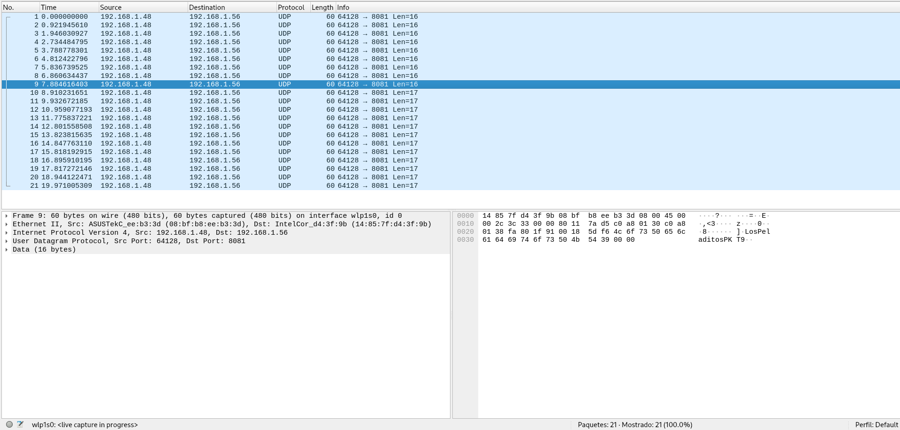
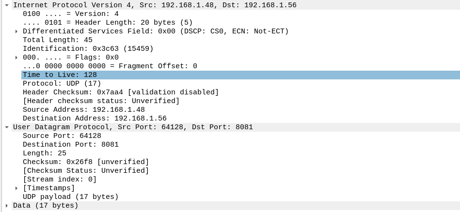
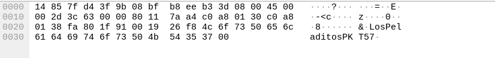
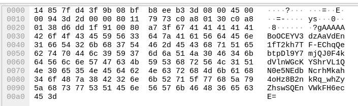

# **Universidad Nacional de Córdoba**
# **Facultad de Ciencias Exactas, Físicas y Naturales**

## **Trabajo Práctico N°5:** Aaa

**Integrantes del Grupo:**
*   Agustin Trachta
*   Agustin Pallardo
*   Mateo Rodriguez
*   Tomas Cisneros
  
**Profesor/a:** SANTIAGO MARTIN HENN

---

# 1 - Scripts para enviar y recibir secuencias de paquetes por TCP

## 1.1 - Tráfico TCP entre dos computadoras

Para esta primera etapa, se han creado estos códigos que enviarán una secuencia incremental cada un segundo, así luego se podrán verificar los datos y el orden en Wireshark. Un servidor será el encargado de recibir los mensajes y procesarlos, mientras esa misma PC será la que recibe los datos por Wireshark. El cliente se conecta al servidor, y una vez establecida la conexión, comienza a transmitir datos.

Código servidor (recibe los datos):

```python
import socket

HOST = '0.0.0.0'  # Escuchar en todas las interfaces
PORT = 8080       # Puerto TCP a usar

def main():
    with socket.socket(socket.AF_INET, socket.SOCK_STREAM) as s:
        s.bind((HOST, PORT))
        s.listen()
        print(f"Servidor esperando conexión en {HOST}:{PORT}...")
        conn, addr = s.accept()
        with conn:
            print(f"Conectado con {addr}")
            while True:
                data = conn.recv(1024)
                if not data:
                    break
                print(f"Recibido: {data.decode()}")

if __name__ == "__main__":
    main()
```

Código cliente (transmite los datos):

```python
import socket
import time

GRUPO = "LosPeladitos"  # Nombre del grupo
NUM_PAQUETES = 100      # Número de paquetes a enviar
INTERVALO_SEGUNDOS = 1  # Intervalo entre envíos en segundos

# Dirección del servidor
HOST = '192.168.100.57'
PORT = 8080

def main():
    with socket.socket(socket.AF_INET, socket.SOCK_STREAM) as s:
        s.connect((HOST, PORT))
        print(f"Conectado a {HOST}:{PORT}")
        for i in range(1, NUM_PAQUETES + 1):
            mensaje = f"{GRUPO}_PKT_{i}"
            s.sendall(mensaje.encode())
            print(f"Enviado: {mensaje}")
            time.sleep(INTERVALO_SEGUNDOS)

if __name__ == "__main__":
    main()

```

Mientras se ejecutan ambos scripts, en Wireshark se van registrando los paquetes. Para facilitar la lectura se colocó el filtro "**(eth.dst==b4:6b:fc:9b:a2:26) || (eth.src==b4:6b:fc:9b:a2:26)**" que indica que solamente muestre paquetes que se envían o se reciben a esa dirección MAC. Analizando las capturas, se pueden observar los paquetes transmitidos por el cliente y los ACK de respuesta del servidor.

Paquete del cliente:


Respuesta del servidor:


Carga útil:


---

## 1.2 - Tráfico TCP con log de transmisión y recepción

Modificando el código, ahora registramos los datos de la comunicación en un log. Además, se disminuyó el tiempo de espera entre transmisiones a 1 ms.

Código servidor:

```python
import socket
from datetime import datetime

HOST = '0.0.0.0'  # Escuchar en todas las interfaces
PORT = 8080       # Puerto TCP a usar

def log_event(message):
    timestamp = datetime.now().strftime('%Y-%m-%d %H:%M:%S.%f')
    with open("tcp_server_log.txt", "a") as log:
        log.write(f"[{timestamp}] Recibido: {message}\n")

def main():
    with socket.socket(socket.AF_INET, socket.SOCK_STREAM) as s:
        s.bind((HOST, PORT))
        s.listen()
        print(f"Servidor esperando conexión en {HOST}:{PORT}...")
        conn, addr = s.accept()
        with conn:
            print(f"Conectado con {addr}")
            while True:
                data = conn.recv(1024)
                if not data:
                    break
                mensaje = data.decode()
                print(f"Recibido: {mensaje}")
                log_event(mensaje)

if __name__ == "__main__":
    main()
```

Código cliente:

```python
import socket
import time
from datetime import datetime

GRUPO = "LosPeladitos" # Nombre del grupo
NUM_PAQUETES = 100     # Número de paquetes a enviar
INTERVALO_SEGUNDOS = 1 # Intervalo entre envíos en segundos

# Dirección del servidor
HOST = '192.168.100.57'
PORT = 8080

def log_event(message):
    timestamp = datetime.now().strftime('%Y-%m-%d %H:%M:%S.%f')
    with open("tcp_client_log.txt", "a") as log:
        log.write(f"[{timestamp}] Enviado: {message}\n")

def main():
    with socket.socket(socket.AF_INET, socket.SOCK_STREAM) as s:
        s.connect((HOST, PORT))
        print(f"Conectado a {HOST}:{PORT}")
        for i in range(1, NUM_PAQUETES + 1):
            mensaje = f"{GRUPO}_PKT_{i}"
            s.sendall(mensaje.encode())
            print(f"Enviado: {mensaje}")
            log_event(mensaje)
            #time.sleep(INTERVALO_SEGUNDOS)

if __name__ == "__main__":
    main()

```

---

## 1.3 - Métricas de la transmisión TCP

Los logs obtenidos contienen lo siguiente:

Log del servidor:

```
[2025-05-27 23:13:25.158333] Recibido: LosPeladitos_PKT_1
[2025-05-27 23:13:25.159603] Recibido: LosPeladitos_PKT_2
[2025-05-27 23:13:25.161288] Recibido: LosPeladitos_PKT_3
[2025-05-27 23:13:25.162574] Recibido: LosPeladitos_PKT_4
[2025-05-27 23:13:25.163690] Recibido: LosPeladitos_PKT_5
[2025-05-27 23:13:25.165069] Recibido: LosPeladitos_PKT_6
[2025-05-27 23:13:25.166531] Recibido: LosPeladitos_PKT_7
[2025-05-27 23:13:25.167442] Recibido: LosPeladitos_PKT_8
[2025-05-27 23:13:25.169085] Recibido: LosPeladitos_PKT_9
[2025-05-27 23:13:25.170409] Recibido: LosPeladitos_PKT_10
[2025-05-27 23:13:25.171763] Recibido: LosPeladitos_PKT_11
[2025-05-27 23:13:25.173196] Recibido: LosPeladitos_PKT_12
[2025-05-27 23:13:25.173890] Recibido: LosPeladitos_PKT_13
[2025-05-27 23:13:25.175404] Recibido: LosPeladitos_PKT_14
[2025-05-27 23:13:25.176909] Recibido: LosPeladitos_PKT_15
[2025-05-27 23:13:25.178387] Recibido: LosPeladitos_PKT_16
[2025-05-27 23:13:25.179954] Recibido: LosPeladitos_PKT_17
[2025-05-27 23:13:25.180899] Recibido: LosPeladitos_PKT_18
[2025-05-27 23:13:25.182827] Recibido: LosPeladitos_PKT_19
[2025-05-27 23:13:25.184773] Recibido: LosPeladitos_PKT_20LosPeladitos_PKT_21
[2025-05-27 23:13:25.186377] Recibido: LosPeladitos_PKT_22
[2025-05-27 23:13:25.187975] Recibido: LosPeladitos_PKT_23
[2025-05-27 23:13:25.189570] Recibido: LosPeladitos_PKT_24
[2025-05-27 23:13:25.190940] Recibido: LosPeladitos_PKT_25
[2025-05-27 23:13:25.192329] Recibido: LosPeladitos_PKT_26
[2025-05-27 23:13:25.193926] Recibido: LosPeladitos_PKT_27
[2025-05-27 23:13:25.194529] Recibido: LosPeladitos_PKT_28
[2025-05-27 23:13:25.196001] Recibido: LosPeladitos_PKT_29
[2025-05-27 23:13:25.197311] Recibido: LosPeladitos_PKT_30
[2025-05-27 23:13:25.198830] Recibido: LosPeladitos_PKT_31
[2025-05-27 23:13:25.199846] Recibido: LosPeladitos_PKT_32
[2025-05-27 23:13:25.201215] Recibido: LosPeladitos_PKT_33
[2025-05-27 23:13:25.202790] Recibido: LosPeladitos_PKT_34
[2025-05-27 23:13:25.204164] Recibido: LosPeladitos_PKT_35
[2025-05-27 23:13:25.205861] Recibido: LosPeladitos_PKT_36
[2025-05-27 23:13:25.206438] Recibido: LosPeladitos_PKT_37
[2025-05-27 23:13:25.207931] Recibido: LosPeladitos_PKT_38
[2025-05-27 23:13:25.209415] Recibido: LosPeladitos_PKT_39
[2025-05-27 23:13:25.210837] Recibido: LosPeladitos_PKT_40
[2025-05-27 23:13:25.212398] Recibido: LosPeladitos_PKT_41
[2025-05-27 23:13:25.214592] Recibido: LosPeladitos_PKT_42LosPeladitos_PKT_43
[2025-05-27 23:13:25.216321] Recibido: LosPeladitos_PKT_44
[2025-05-27 23:13:25.217611] Recibido: LosPeladitos_PKT_45
[2025-05-27 23:13:25.219215] Recibido: LosPeladitos_PKT_46
[2025-05-27 23:13:25.220734] Recibido: LosPeladitos_PKT_47
[2025-05-27 23:13:25.221513] Recibido: LosPeladitos_PKT_48
[2025-05-27 23:13:25.223090] Recibido: LosPeladitos_PKT_49
[2025-05-27 23:13:25.224551] Recibido: LosPeladitos_PKT_50
[2025-05-27 23:13:25.225348] Recibido: LosPeladitos_PKT_51
[2025-05-27 23:13:25.226873] Recibido: LosPeladitos_PKT_52
[2025-05-27 23:13:25.228344] Recibido: LosPeladitos_PKT_53
[2025-05-27 23:13:25.229759] Recibido: LosPeladitos_PKT_54
[2025-05-27 23:13:25.230663] Recibido: LosPeladitos_PKT_55
[2025-05-27 23:13:25.233043] Recibido: LosPeladitos_PKT_56LosPeladitos_PKT_57
[2025-05-27 23:13:25.234681] Recibido: LosPeladitos_PKT_58
[2025-05-27 23:13:25.236151] Recibido: LosPeladitos_PKT_59
[2025-05-27 23:13:25.237993] Recibido: LosPeladitos_PKT_60
[2025-05-27 23:13:25.238674] Recibido: LosPeladitos_PKT_61
[2025-05-27 23:13:25.239915] Recibido: LosPeladitos_PKT_62
[2025-05-27 23:13:25.241722] Recibido: LosPeladitos_PKT_63
[2025-05-27 23:13:25.242400] Recibido: LosPeladitos_PKT_64
[2025-05-27 23:13:25.244064] Recibido: LosPeladitos_PKT_65
[2025-05-27 23:13:25.245694] Recibido: LosPeladitos_PKT_66
[2025-05-27 23:13:25.246391] Recibido: LosPeladitos_PKT_67
[2025-05-27 23:13:25.247884] Recibido: LosPeladitos_PKT_68
[2025-05-27 23:13:25.249410] Recibido: LosPeladitos_PKT_69
[2025-05-27 23:13:25.250706] Recibido: LosPeladitos_PKT_70
[2025-05-27 23:13:25.252233] Recibido: LosPeladitos_PKT_71
[2025-05-27 23:13:25.253719] Recibido: LosPeladitos_PKT_72
[2025-05-27 23:13:25.255063] Recibido: LosPeladitos_PKT_73
[2025-05-27 23:13:25.255765] Recibido: LosPeladitos_PKT_74
[2025-05-27 23:13:25.257271] Recibido: LosPeladitos_PKT_75
[2025-05-27 23:13:25.258623] Recibido: LosPeladitos_PKT_76
[2025-05-27 23:13:25.259992] Recibido: LosPeladitos_PKT_77
[2025-05-27 23:13:25.260709] Recibido: LosPeladitos_PKT_78
[2025-05-27 23:13:25.262620] Recibido: LosPeladitos_PKT_79
[2025-05-27 23:13:25.263562] Recibido: LosPeladitos_PKT_80
[2025-05-27 23:13:25.264808] Recibido: LosPeladitos_PKT_81
[2025-05-27 23:13:25.266064] Recibido: LosPeladitos_PKT_82
[2025-05-27 23:13:25.267731] Recibido: LosPeladitos_PKT_83
[2025-05-27 23:13:25.268442] Recibido: LosPeladitos_PKT_84
[2025-05-27 23:13:25.269925] Recibido: LosPeladitos_PKT_85
[2025-05-27 23:13:25.271270] Recibido: LosPeladitos_PKT_86
[2025-05-27 23:13:25.272613] Recibido: LosPeladitos_PKT_87
[2025-05-27 23:13:25.274699] Recibido: LosPeladitos_PKT_88
[2025-05-27 23:13:25.275889] Recibido: LosPeladitos_PKT_89
[2025-05-27 23:13:25.276565] Recibido: LosPeladitos_PKT_90
[2025-05-27 23:13:25.278118] Recibido: LosPeladitos_PKT_91
[2025-05-27 23:13:25.278821] Recibido: LosPeladitos_PKT_92
[2025-05-27 23:13:25.280498] Recibido: LosPeladitos_PKT_93
[2025-05-27 23:13:25.281941] Recibido: LosPeladitos_PKT_94
[2025-05-27 23:13:25.283746] Recibido: LosPeladitos_PKT_95
[2025-05-27 23:13:25.286818] Recibido: LosPeladitos_PKT_96LosPeladitos_PKT_97
[2025-05-27 23:13:25.287430] Recibido: LosPeladitos_PKT_98
[2025-05-27 23:13:25.288803] Recibido: LosPeladitos_PKT_99
[2025-05-27 23:13:25.290179] Recibido: LosPeladitos_PKT_100
```

Log del cliente:

```
[2025-05-27 23:13:25.094974] Enviado: LosPeladitos_PKT_1
[2025-05-27 23:13:25.096352] Enviado: LosPeladitos_PKT_2
[2025-05-27 23:13:25.097654] Enviado: LosPeladitos_PKT_3
[2025-05-27 23:13:25.098991] Enviado: LosPeladitos_PKT_4
[2025-05-27 23:13:25.100252] Enviado: LosPeladitos_PKT_5
[2025-05-27 23:13:25.101582] Enviado: LosPeladitos_PKT_6
[2025-05-27 23:13:25.102835] Enviado: LosPeladitos_PKT_7
[2025-05-27 23:13:25.104171] Enviado: LosPeladitos_PKT_8
[2025-05-27 23:13:25.105508] Enviado: LosPeladitos_PKT_9
[2025-05-27 23:13:25.106859] Enviado: LosPeladitos_PKT_10
[2025-05-27 23:13:25.108194] Enviado: LosPeladitos_PKT_11
[2025-05-27 23:13:25.109567] Enviado: LosPeladitos_PKT_12
[2025-05-27 23:13:25.110860] Enviado: LosPeladitos_PKT_13
[2025-05-27 23:13:25.112134] Enviado: LosPeladitos_PKT_14
[2025-05-27 23:13:25.113590] Enviado: LosPeladitos_PKT_15
[2025-05-27 23:13:25.115094] Enviado: LosPeladitos_PKT_16
[2025-05-27 23:13:25.116299] Enviado: LosPeladitos_PKT_17
[2025-05-27 23:13:25.117604] Enviado: LosPeladitos_PKT_18
[2025-05-27 23:13:25.118806] Enviado: LosPeladitos_PKT_19
[2025-05-27 23:13:25.120154] Enviado: LosPeladitos_PKT_20
[2025-05-27 23:13:25.121540] Enviado: LosPeladitos_PKT_21
[2025-05-27 23:13:25.123129] Enviado: LosPeladitos_PKT_22
[2025-05-27 23:13:25.124633] Enviado: LosPeladitos_PKT_23
[2025-05-27 23:13:25.126084] Enviado: LosPeladitos_PKT_24
[2025-05-27 23:13:25.127499] Enviado: LosPeladitos_PKT_25
[2025-05-27 23:13:25.128953] Enviado: LosPeladitos_PKT_26
[2025-05-27 23:13:25.130113] Enviado: LosPeladitos_PKT_27
[2025-05-27 23:13:25.131449] Enviado: LosPeladitos_PKT_28
[2025-05-27 23:13:25.132637] Enviado: LosPeladitos_PKT_29
[2025-05-27 23:13:25.133990] Enviado: LosPeladitos_PKT_30
[2025-05-27 23:13:25.135198] Enviado: LosPeladitos_PKT_31
[2025-05-27 23:13:25.136472] Enviado: LosPeladitos_PKT_32
[2025-05-27 23:13:25.137985] Enviado: LosPeladitos_PKT_33
[2025-05-27 23:13:25.139470] Enviado: LosPeladitos_PKT_34
[2025-05-27 23:13:25.140895] Enviado: LosPeladitos_PKT_35
[2025-05-27 23:13:25.142124] Enviado: LosPeladitos_PKT_36
[2025-05-27 23:13:25.143377] Enviado: LosPeladitos_PKT_37
[2025-05-27 23:13:25.144606] Enviado: LosPeladitos_PKT_38
[2025-05-27 23:13:25.146057] Enviado: LosPeladitos_PKT_39
[2025-05-27 23:13:25.147469] Enviado: LosPeladitos_PKT_40
[2025-05-27 23:13:25.148888] Enviado: LosPeladitos_PKT_41
[2025-05-27 23:13:25.150130] Enviado: LosPeladitos_PKT_42
[2025-05-27 23:13:25.151415] Enviado: LosPeladitos_PKT_43
[2025-05-27 23:13:25.152671] Enviado: LosPeladitos_PKT_44
[2025-05-27 23:13:25.154006] Enviado: LosPeladitos_PKT_45
[2025-05-27 23:13:25.155474] Enviado: LosPeladitos_PKT_46
[2025-05-27 23:13:25.156971] Enviado: LosPeladitos_PKT_47
[2025-05-27 23:13:25.158195] Enviado: LosPeladitos_PKT_48
[2025-05-27 23:13:25.159553] Enviado: LosPeladitos_PKT_49
[2025-05-27 23:13:25.160893] Enviado: LosPeladitos_PKT_50
[2025-05-27 23:13:25.162104] Enviado: LosPeladitos_PKT_51
[2025-05-27 23:13:25.163398] Enviado: LosPeladitos_PKT_52
[2025-05-27 23:13:25.164741] Enviado: LosPeladitos_PKT_53
[2025-05-27 23:13:25.166081] Enviado: LosPeladitos_PKT_54
[2025-05-27 23:13:25.167233] Enviado: LosPeladitos_PKT_55
[2025-05-27 23:13:25.168389] Enviado: LosPeladitos_PKT_56
[2025-05-27 23:13:25.169652] Enviado: LosPeladitos_PKT_57
[2025-05-27 23:13:25.171063] Enviado: LosPeladitos_PKT_58
[2025-05-27 23:13:25.172419] Enviado: LosPeladitos_PKT_59
[2025-05-27 23:13:25.173820] Enviado: LosPeladitos_PKT_60
[2025-05-27 23:13:25.175103] Enviado: LosPeladitos_PKT_61
[2025-05-27 23:13:25.176520] Enviado: LosPeladitos_PKT_62
[2025-05-27 23:13:25.177930] Enviado: LosPeladitos_PKT_63
[2025-05-27 23:13:25.179145] Enviado: LosPeladitos_PKT_64
[2025-05-27 23:13:25.180527] Enviado: LosPeladitos_PKT_65
[2025-05-27 23:13:25.181910] Enviado: LosPeladitos_PKT_66
[2025-05-27 23:13:25.183164] Enviado: LosPeladitos_PKT_67
[2025-05-27 23:13:25.184541] Enviado: LosPeladitos_PKT_68
[2025-05-27 23:13:25.185788] Enviado: LosPeladitos_PKT_69
[2025-05-27 23:13:25.187053] Enviado: LosPeladitos_PKT_70
[2025-05-27 23:13:25.188511] Enviado: LosPeladitos_PKT_71
[2025-05-27 23:13:25.189979] Enviado: LosPeladitos_PKT_72
[2025-05-27 23:13:25.191358] Enviado: LosPeladitos_PKT_73
[2025-05-27 23:13:25.192690] Enviado: LosPeladitos_PKT_74
[2025-05-27 23:13:25.193885] Enviado: LosPeladitos_PKT_75
[2025-05-27 23:13:25.195105] Enviado: LosPeladitos_PKT_76
[2025-05-27 23:13:25.196433] Enviado: LosPeladitos_PKT_77
[2025-05-27 23:13:25.197688] Enviado: LosPeladitos_PKT_78
[2025-05-27 23:13:25.198918] Enviado: LosPeladitos_PKT_79
[2025-05-27 23:13:25.200102] Enviado: LosPeladitos_PKT_80
[2025-05-27 23:13:25.201275] Enviado: LosPeladitos_PKT_81
[2025-05-27 23:13:25.202492] Enviado: LosPeladitos_PKT_82
[2025-05-27 23:13:25.203760] Enviado: LosPeladitos_PKT_83
[2025-05-27 23:13:25.205041] Enviado: LosPeladitos_PKT_84
[2025-05-27 23:13:25.206351] Enviado: LosPeladitos_PKT_85
[2025-05-27 23:13:25.207689] Enviado: LosPeladitos_PKT_86
[2025-05-27 23:13:25.209066] Enviado: LosPeladitos_PKT_87
[2025-05-27 23:13:25.210478] Enviado: LosPeladitos_PKT_88
[2025-05-27 23:13:25.211858] Enviado: LosPeladitos_PKT_89
[2025-05-27 23:13:25.213084] Enviado: LosPeladitos_PKT_90
[2025-05-27 23:13:25.214442] Enviado: LosPeladitos_PKT_91
[2025-05-27 23:13:25.215723] Enviado: LosPeladitos_PKT_92
[2025-05-27 23:13:25.217137] Enviado: LosPeladitos_PKT_93
[2025-05-27 23:13:25.218399] Enviado: LosPeladitos_PKT_94
[2025-05-27 23:13:25.219708] Enviado: LosPeladitos_PKT_95
[2025-05-27 23:13:25.221044] Enviado: LosPeladitos_PKT_96
[2025-05-27 23:13:25.222450] Enviado: LosPeladitos_PKT_97
[2025-05-27 23:13:25.224056] Enviado: LosPeladitos_PKT_98
[2025-05-27 23:13:25.225305] Enviado: LosPeladitos_PKT_99
[2025-05-27 23:13:25.226702] Enviado: LosPeladitos_PKT_100
```

Partiendo de estos resultados, podemos calcular lo siguiente:

**Latencia promedio**	63.41 ms

**Latencia mínima**	63.25 ms

**Latencia máxima**	63.63 ms

**Jitter promedio**	0.25 ms

---

# 2 - Scripts para enviar y recibir secuencias de paquetes por TCP

## 2.1 – Tráfico UDP entre dos computadoras

En esta primera etapa de la segunda parte hemos implementado dos scripts en Python que envían y reciben datagramas UDP de manera secuencial. El **cliente** envía cada segundo un paquete con identificador único (`<GRUPO>_PKT_<n>`) al **servidor**, y éste lo recibe, muestra por consola el remitente y el mensaje, y lo registra en un log con marca de tiempo. De esta forma podemos verificar en Wireshark tanto la llegada de cada datagrama como su contenido.

A continuación, el código del **servidor** (recibe los datagramas UDP en el puerto 8081):

```python
import socket
from datetime import datetime

HOST = '0.0.0.0'   # Escucha en todas las interfaces
PORT = 8081        # Puerto UDP para recibir los datagramas

def log_event(message):
    ts = datetime.now().strftime('%Y-%m-%d %H:%M:%S.%f')
    with open("udp_server_log.txt", "a") as f:
        f.write(f"[{ts}] Recibido: {message}\n")

def main():
    with socket.socket(socket.AF_INET, socket.SOCK_DGRAM) as s:
        s.bind((HOST, PORT))
        print(f"Servidor UDP escuchando en {HOST}:{PORT}…")
        while True:
            data, addr = s.recvfrom(1024)
            if not data:
                continue
            mensaje = data.decode()
            print(f"{addr} → {mensaje}")
            log_event(mensaje)

if __name__ == "__main__":
    main()

```
## Código cliente (envía los datagramas)

```python
import socket
import time
from datetime import datetime

GRUPO = "LosPeladitos"
NUM_PAQUETES = 100
INTERVALO_SEGUNDOS = 1.0
HOST = '192.168.1.56'  # IP del servidor
PORT = 8081

def log_event(message):
    ts = datetime.now().strftime('%Y-%m-%d %H:%M:%S.%f')
    with open("udp_client_log.txt", "a") as f:
        f.write(f"[{ts}] Enviado: {message}\n")

def main():
    with socket.socket(socket.AF_INET, socket.SOCK_DGRAM) as s:
        for i in range(1, NUM_PAQUETES + 1):
            msg = f"{GRUPO}_PKT_{i}"
            s.sendto(msg.encode(), (HOST, PORT))
            print(f"Enviado: {msg}")
            log_event(msg)
            time.sleep(INTERVALO_SEGUNDOS)

if __name__ == "__main__":
    main()

```

### 2.1.a – Captura de tráfico UDP en Wireshark

1. **Lista de paquetes filtrados**  
   

2. **Detalle de un paquete**  
   

3. **Carga útil (Follow UDP Stream)**  
   


---

## 2.2 - Tráfico UDP con log de transmisión y recepción

## 2.2 – Logging de paquetes UDP

Para persistir los paquetes enviados y recibidos con su timestamp, hemos añadido una función `log_event()` en cliente y servidor. A continuación se muestran extractos de los archivos de log generados durante una prueba de 10 paquetes (enviados cada ~1 s).

### 2.2.1 – Log del cliente (`udp_client_log.txt`)

```text
# udp_client_log.txt
[2025-05-29 05:17:33.153320] Enviado: LosPeladitosPKT1
[2025-05-29 05:17:34.154196] Enviado: LosPeladitosPKT2
[2025-05-29 05:17:35.155134] Enviado: LosPeladitosPKT3
[2025-05-29 05:17:36.156072] Enviado: LosPeladitosPKT4
[2025-05-29 05:17:37.157062] Enviado: LosPeladitosPKT5
[2025-05-29 05:17:38.158194] Enviado: LosPeladitosPKT6
[2025-05-29 05:17:39.158948] Enviado: LosPeladitosPKT7
[2025-05-29 05:17:40.159568] Enviado: LosPeladitosPKT8
[2025-05-29 05:17:41.160303] Enviado: LosPeladitosPKT9
[2025-05-29 05:17:42.161076] Enviado: LosPeladitosPKT10
[2025-05-29 05:17:43.162137] Enviado: LosPeladitosPKT11
[2025-05-29 05:17:44.163130] Enviado: LosPeladitosPKT12
[2025-05-29 05:17:45.163844] Enviado: LosPeladitosPKT13
[2025-05-29 05:17:46.164568] Enviado: LosPeladitosPKT14
[2025-05-29 05:17:47.165474] Enviado: LosPeladitosPKT15
[2025-05-29 05:17:48.166233] Enviado: LosPeladitosPKT16
[2025-05-29 05:17:49.167379] Enviado: LosPeladitosPKT17
[2025-05-29 05:17:50.168054] Enviado: LosPeladitosPKT18
[2025-05-29 05:17:51.168965] Enviado: LosPeladitosPKT19
[2025-05-29 05:17:52.180177] Enviado: LosPeladitosPKT20
[2025-05-29 05:17:53.180862] Enviado: LosPeladitosPKT21
[2025-05-29 05:17:54.181719] Enviado: LosPeladitosPKT22
[2025-05-29 05:17:55.182741] Enviado: LosPeladitosPKT23
[2025-05-29 05:17:56.183546] Enviado: LosPeladitosPKT24
[2025-05-29 05:17:57.184258] Enviado: LosPeladitosPKT25
[2025-05-29 05:17:58.185353] Enviado: LosPeladitosPKT26
[2025-05-29 05:17:59.185992] Enviado: LosPeladitosPKT27
[2025-05-29 05:18:00.187263] Enviado: LosPeladitosPKT28
[2025-05-29 05:18:01.188273] Enviado: LosPeladitosPKT29
[2025-05-29 05:18:02.189168] Enviado: LosPeladitosPKT30
[2025-05-29 05:18:03.190265] Enviado: LosPeladitosPKT31
[2025-05-29 05:18:04.190923] Enviado: LosPeladitosPKT32
[2025-05-29 05:18:05.192005] Enviado: LosPeladitosPKT33
[2025-05-29 05:18:06.193099] Enviado: LosPeladitosPKT34
[2025-05-29 05:18:07.193838] Enviado: LosPeladitosPKT35
[2025-05-29 05:18:08.194632] Enviado: LosPeladitosPKT36
[2025-05-29 05:18:09.195315] Enviado: LosPeladitosPKT37
[2025-05-29 05:18:10.196317] Enviado: LosPeladitosPKT38
[2025-05-29 05:18:11.197450] Enviado: LosPeladitosPKT39
[2025-05-29 05:18:12.198424] Enviado: LosPeladitosPKT40
[2025-05-29 05:18:13.199625] Enviado: LosPeladitosPKT41
[2025-05-29 05:18:14.200272] Enviado: LosPeladitosPKT42
[2025-05-29 05:18:15.201143] Enviado: LosPeladitosPKT43
[2025-05-29 05:18:16.202188] Enviado: LosPeladitosPKT44
[2025-05-29 05:18:17.203109] Enviado: LosPeladitosPKT45
[2025-05-29 05:18:18.204119] Enviado: LosPeladitosPKT46
[2025-05-29 05:18:19.205135] Enviado: LosPeladitosPKT47
[2025-05-29 05:18:20.205995] Enviado: LosPeladitosPKT48
[2025-05-29 05:18:21.207027] Enviado: LosPeladitosPKT49
[2025-05-29 05:18:22.207731] Enviado: LosPeladitosPKT50
[2025-05-29 05:18:23.208398] Enviado: LosPeladitosPKT51
[2025-05-29 05:18:24.209177] Enviado: LosPeladitosPKT52
[2025-05-29 05:18:25.209891] Enviado: LosPeladitosPKT53
[2025-05-29 05:18:26.210746] Enviado: LosPeladitosPKT54
[2025-05-29 05:18:27.211619] Enviado: LosPeladitosPKT55
[2025-05-29 05:18:28.212314] Enviado: LosPeladitosPKT56
[2025-05-29 05:18:29.213317] Enviado: LosPeladitosPKT57
[2025-05-29 05:18:30.214219] Enviado: LosPeladitosPKT58
[2025-05-29 05:18:31.215303] Enviado: LosPeladitosPKT59
[2025-05-29 05:18:32.216023] Enviado: LosPeladitosPKT60
[2025-05-29 05:18:33.216829] Enviado: LosPeladitosPKT61
[2025-05-29 05:18:34.218000] Enviado: LosPeladitosPKT62
[2025-05-29 05:18:35.219124] Enviado: LosPeladitosPKT63
[2025-05-29 05:18:36.220278] Enviado: LosPeladitosPKT64
[2025-05-29 05:18:37.221303] Enviado: LosPeladitosPKT65
[2025-05-29 05:18:38.222002] Enviado: LosPeladitosPKT66
[2025-05-29 05:18:41.282238] Enviado: LosPeladitosPKT67
[2025-05-29 05:18:42.283055] Enviado: LosPeladitosPKT68
[2025-05-29 05:18:43.283779] Enviado: LosPeladitosPKT69
[2025-05-29 05:18:44.284486] Enviado: LosPeladitosPKT70
[2025-05-29 05:18:45.285400] Enviado: LosPeladitosPKT71
[2025-05-29 05:18:46.286419] Enviado: LosPeladitosPKT72
[2025-05-29 05:18:47.287624] Enviado: LosPeladitosPKT73
[2025-05-29 05:18:48.288759] Enviado: LosPeladitosPKT74
[2025-05-29 05:18:49.289387] Enviado: LosPeladitosPKT75
[2025-05-29 05:18:50.290139] Enviado: LosPeladitosPKT76
[2025-05-29 05:18:51.291359] Enviado: LosPeladitosPKT77
[2025-05-29 05:18:52.292504] Enviado: LosPeladitosPKT78
[2025-05-29 05:18:53.293194] Enviado: LosPeladitosPKT79
[2025-05-29 05:18:54.293928] Enviado: LosPeladitosPKT80
[2025-05-29 05:18:55.294985] Enviado: LosPeladitosPKT81
[2025-05-29 05:18:56.295618] Enviado: LosPeladitosPKT82
[2025-05-29 05:18:57.296386] Enviado: LosPeladitosPKT83
[2025-05-29 05:18:58.297376] Enviado: LosPeladitosPKT84
[2025-05-29 05:19:11.631571] Enviado: LosPeladitosPKT85
[2025-05-29 05:19:12.632318] Enviado: LosPeladitosPKT86
[2025-05-29 05:19:13.633029] Enviado: LosPeladitosPKT87
[2025-05-29 05:19:14.633682] Enviado: LosPeladitosPKT88
[2025-05-29 05:19:15.634386] Enviado: LosPeladitosPKT89
[2025-05-29 05:19:16.635139] Enviado: LosPeladitosPKT90
[2025-05-29 05:19:17.635921] Enviado: LosPeladitosPKT91
[2025-05-29 05:19:18.637020] Enviado: LosPeladitosPKT92
[2025-05-29 05:19:19.638011] Enviado: LosPeladitosPKT93
[2025-05-29 05:19:20.638678] Enviado: LosPeladitosPKT94
[2025-05-29 05:19:21.639459] Enviado: LosPeladitosPKT95
[2025-05-29 05:19:22.640623] Enviado: LosPeladitosPKT96
[2025-05-29 05:19:23.641717] Enviado: LosPeladitosPKT97
[2025-05-29 05:19:24.642548] Enviado: LosPeladitosPKT98
[2025-05-29 05:19:25.643310] Enviado: LosPeladitosPKT99
[2025-05-29 05:19:26.643960] Enviado: LosPeladitosPKT100

# udp_server_log.txt
[2025-05-29 05:17:33.317630] Recibido: LosPeladitosPKT1
[2025-05-29 05:17:34.345842] Recibido: LosPeladitosPKT2
[2025-05-29 05:17:35.161372] Recibido: LosPeladitosPKT3
[2025-05-29 05:17:36.185544] Recibido: LosPeladitosPKT4
[2025-05-29 05:17:37.209861] Recibido: LosPeladitosPKT5
[2025-05-29 05:17:38.117437] Recibido: LosPeladitosPKT6
[2025-05-29 05:17:39.258065] Recibido: LosPeladitosPKT7
[2025-05-29 05:17:40.118992] Recibido: LosPeladitosPKT8
[2025-05-29 05:17:41.304997] Recibido: LosPeladitosPKT9
[2025-05-29 05:17:42.328792] Recibido: LosPeladitosPKT10
[2025-05-29 05:17:43.150534] Recibido: LosPeladitosPKT11
[2025-05-29 05:17:44.171671] Recibido: LosPeladitosPKT12
[2025-05-29 05:17:45.195871] Recibido: LosPeladitosPKT13
[2025-05-29 05:17:46.219590] Recibido: LosPeladitosPKT14
[2025-05-29 05:17:47.244767] Recibido: LosPeladitosPKT15
[2025-05-29 05:17:48.268774] Recibido: LosPeladitosPKT16
[2025-05-29 05:17:49.291609] Recibido: LosPeladitosPKT17
[2025-05-29 05:17:50.315558] Recibido: LosPeladitosPKT18
[2025-05-29 05:17:51.340125] Recibido: LosPeladitosPKT19
[2025-05-29 05:17:52.365898] Recibido: LosPeladitosPKT20
[2025-05-29 05:17:53.184432] Recibido: LosPeladitosPKT21
[2025-05-29 05:17:54.207405] Recibido: LosPeladitosPKT22
[2025-05-29 05:17:55.141830] Recibido: LosPeladitosPKT23
[2025-05-29 05:17:56.255825] Recibido: LosPeladitosPKT24
[2025-05-29 05:17:57.280626] Recibido: LosPeladitosPKT25
[2025-05-29 05:17:58.303824] Recibido: LosPeladitosPKT26
[2025-05-29 05:17:59.144496] Recibido: LosPeladitosPKT27
[2025-05-29 05:18:00.351744] Recibido: LosPeladitosPKT28
[2025-05-29 05:18:01.374518] Recibido: LosPeladitosPKT29
[2025-05-29 05:18:02.193718] Recibido: LosPeladitosPKT30
[2025-05-29 05:18:03.218250] Recibido: LosPeladitosPKT31
[2025-05-29 05:18:04.241673] Recibido: LosPeladitosPKT32
[2025-05-29 05:18:05.266127] Recibido: LosPeladitosPKT33
[2025-05-29 05:18:06.289915] Recibido: LosPeladitosPKT34
[2025-05-29 05:18:07.313935] Recibido: LosPeladitosPKT35
[2025-05-29 05:18:08.235012] Recibido: LosPeladitosPKT36
[2025-05-29 05:18:09.362017] Recibido: LosPeladitosPKT37
[2025-05-29 05:18:10.180734] Recibido: LosPeladitosPKT38
[2025-05-29 05:18:11.307314] Recibido: LosPeladitosPKT39
[2025-05-29 05:18:12.228644] Recibido: LosPeladitosPKT40
[2025-05-29 05:18:13.252679] Recibido: LosPeladitosPKT41
[2025-05-29 05:18:14.276610] Recibido: LosPeladitosPKT42
[2025-05-29 05:18:15.198561] Recibido: LosPeladitosPKT43
[2025-05-29 05:18:16.324632] Recibido: LosPeladitosPKT44
[2025-05-29 05:18:17.160927] Recibido: LosPeladitosPKT45
[2025-05-29 05:18:18.169169] Recibido: LosPeladitosPKT46
[2025-05-29 05:18:19.193408] Recibido: LosPeladitosPKT47
[2025-05-29 05:18:20.217144] Recibido: LosPeladitosPKT48
[2025-05-29 05:18:21.164691] Recibido: LosPeladitosPKT49
[2025-05-29 05:18:22.165321] Recibido: LosPeladitosPKT50
[2025-05-29 05:18:23.165912] Recibido: LosPeladitosPKT51
[2025-05-29 05:18:24.209078] Recibido: LosPeladitosPKT52
[2025-05-29 05:18:25.178732] Recibido: LosPeladitosPKT53
[2025-05-29 05:18:26.168147] Recibido: LosPeladitosPKT54
[2025-05-29 05:18:27.180214] Recibido: LosPeladitosPKT55
[2025-05-29 05:18:28.204436] Recibido: LosPeladitosPKT56
[2025-05-29 05:18:29.170647] Recibido: LosPeladitosPKT57
[2025-05-29 05:18:30.267414] Recibido: LosPeladitosPKT58
[2025-05-29 05:18:31.303889] Recibido: LosPeladitosPKT59
[2025-05-29 05:18:32.298632] Recibido: LosPeladitosPKT60
[2025-05-29 05:18:33.322618] Recibido: LosPeladitosPKT61
[2025-05-29 05:18:34.346554] Recibido: LosPeladitosPKT62
[2025-05-29 05:18:35.344400] Recibido: LosPeladitosPKT63
[2025-05-29 05:18:36.213041] Recibido: LosPeladitosPKT64
[2025-05-29 05:18:37.178385] Recibido: LosPeladitosPKT65
[2025-05-29 05:18:38.179057] Recibido: LosPeladitosPKT66
[2025-05-29 05:18:41.240159] Recibido: LosPeladitosPKT67
[2025-05-29 05:18:42.334825] Recibido: LosPeladitosPKT68
[2025-05-29 05:18:43.359061] Recibido: LosPeladitosPKT69
[2025-05-29 05:18:44.383594] Recibido: LosPeladitosPKT70
[2025-05-29 05:18:45.407598] Recibido: LosPeladitosPKT71
[2025-05-29 05:18:46.245382] Recibido: LosPeladitosPKT72
[2025-05-29 05:18:47.353582] Recibido: LosPeladitosPKT73
[2025-05-29 05:18:48.276924] Recibido: LosPeladitosPKT74
[2025-05-29 05:18:49.249072] Recibido: LosPeladitosPKT75
[2025-05-29 05:18:50.249953] Recibido: LosPeladitosPKT76
[2025-05-29 05:18:51.349579] Recibido: LosPeladitosPKT77
[2025-05-29 05:18:52.373880] Recibido: LosPeladitosPKT78
[2025-05-29 05:18:53.267968] Recibido: LosPeladitosPKT79
[2025-05-29 05:18:54.422383] Recibido: LosPeladitosPKT80
[2025-05-29 05:18:55.345617] Recibido: LosPeladitosPKT81
[2025-05-29 05:18:56.470202] Recibido: LosPeladitosPKT82
[2025-05-29 05:18:57.291992] Recibido: LosPeladitosPKT83
[2025-05-29 05:18:58.314611] Recibido: LosPeladitosPKT84
[2025-05-29 05:19:11.596379] Recibido: LosPeladitosPKT85
[2025-05-29 05:19:12.652579] Recibido: LosPeladitosPKT86
[2025-05-29 05:19:13.676494] Recibido: LosPeladitosPKT87
[2025-05-29 05:19:14.599205] Recibido: LosPeladitosPKT88
[2025-05-29 05:19:15.600074] Recibido: LosPeladitosPKT89
[2025-05-29 05:19:16.601696] Recibido: LosPeladitosPKT90
[2025-05-29 05:19:17.602046] Recibido: LosPeladitosPKT91
[2025-05-29 05:19:18.645113] Recibido: LosPeladitosPKT92
[2025-05-29 05:19:19.822295] Recibido: LosPeladitosPKT93
[2025-05-29 05:19:20.641665] Recibido: LosPeladitosPKT94
[2025-05-29 05:19:21.665906] Recibido: LosPeladitosPKT95
[2025-05-29 05:19:22.690544] Recibido: LosPeladitosPKT96
[2025-05-29 05:19:23.714396] Recibido: LosPeladitosPKT97
[2025-05-29 05:19:24.635874] Recibido: LosPeladitosPKT98
[2025-05-29 05:19:25.763081] Recibido: LosPeladitosPKT99
[2025-05-29 05:19:26.612067] Recibido: LosPeladitosPKT100
```

---

## 2.3 – Cálculo de latencia y jitter

**Script de cálculo** (`calc_udp_metrics.py`):

```python
import re
from datetime import datetime
import statistics

def parse_log(fichero, etiqueta):
    """
    Parsea un log y devuelve un dict {número_paquete: timestamp}.
    Reconoce formatos 'PKT_1' o 'PKT1'.
    """
    patron = re.compile(r"\[(.*?)\].*"+etiqueta+r".*?PKT_?(\d+)")
    datos = {}
    with open(fichero) as f:
        for linea in f:
            m = patron.search(linea)
            if m:
                ts = datetime.strptime(m.group(1), "%Y-%m-%d %H:%M:%S.%f")
                idx = int(m.group(2))
                datos[idx] = ts
    return datos

# parseamos ambos logs
cli = parse_log("udp_client_log.txt", "Enviado")
srv = parse_log("udp_server_log.txt", "Recibido")

# emparejamos y calculamos latencias
latencies = []
for i in sorted(cli):
    if i in srv:
        delta = (srv[i] - cli[i]).total_seconds() * 1000
        latencies.append(delta)

if not latencies:
    print("Error: no se encontraron paquetes. Revisa nombres/formato de logs.")
    exit(1)

# estadísticas
mean_lat = statistics.mean(latencies)
min_lat  = min(latencies)
max_lat  = max(latencies)
jitters = [abs(latencies[i] - latencies[i-1]) for i in range(1, len(latencies))]
mean_jit = statistics.mean(jitters)

print(f"Paquetes considerados: {len(latencies)}")
print(f"Latencia promedio:  {mean_lat:.2f} ms")
print(f"Latencia mínima:     {min_lat:.2f} ms")
print(f"Latencia máxima:     {max_lat:.2f} ms")
print(f"Jitter promedio:     {mean_jit:.2f} ms")

```

**Resultados obtenidos**:
```text
Paquetes considerados: 100
Latencia promedio:  43.77 ms
Latencia mínima:     42.95 ms
Latencia máxima:     191.65 ms
Jitter promedio:     63.84 ms
```

## 3 – Comparación entre un paquete UDP y un paquete TCP


### 3.1 – Diferencias en los campos de encabezado

| Campo               | UDP                                         | TCP                                             |
|---------------------|---------------------------------------------|-------------------------------------------------|
| Protocolo           | UDP (17)                                    | TCP (6)                                         |
| Orientación         | No orientado a conexión (stateless)         | Orientado a conexión (handshake)                |
| Longitud header     | 8 bytes                                     | 20 bytes (sin opciones)                         |
| Número de secuencia | —                                           | Sí, 32 bits                                     |
| Número de acuse     | —                                           | Sí, 32 bits                                     |
| Flags               | —                                           | SYN, ACK, PSH, FIN, RST, …                      |
| Control de flujo    | No                                          | Sí (Window Size)                                |
| Retransmisiones     | No                                          | Sí, detección y reenvío en caso de pérdida      |
| Checksum            | Opcional en IPv4 (aunque por defecto se usa)| Obligatorio                                     |
| Tamaño payload      | 17 bytes (ej: “LosPeladitos_PKT_57”)        | 23 bytes (ej: “LosPeladitos_PKT_23”)            |
| Overhead total      | 8 bytes header UDP + 20 bytes IP = **28 B**  | 20 bytes header TCP + 20 bytes IP = **40B**    |

---

### 3.2 – Tabla comparativa de métricas (100 paquetes)

| Métrica              | TCP                 | UDP                 |
|----------------------|---------------------|---------------------|
| Latencia promedio    | 63.41 ms            | 43.77 ms            |
| Latencia mínima      | 63.25 ms            | 42.95 ms            |
| Latencia máxima      | 63.63 ms            | 191.65 ms           |
| Jitter promedio      | 0.25 ms             | 63.84 ms            |

A partir de estos datos podemos extraer las siguientes conclusiones:

1. **Velocidad frente a consistencia**  
   - **UDP** muestra una **latencia promedio** sensiblemente menor que TCP (≈ 44 ms vs 63 ms), lo que confirma la ausencia de negociación de conexión y ACKs.  
   - **TCP**, aunque un poco más lento, garantiza una entrega más estable gracias a su control de congestión y retransmisiones.

2. **Variabilidad de la transmisión**  
   - El **jitter** y la **latencia máxima** de UDP son muy elevados (≥ 63 ms y un pico en ~192 ms), dato que refleja la naturaleza *“best-effort”* de UDP: sin reintentos ni orden estricto, algunos datagramas pueden retrasarse o perderse.  
   - TCP mantiene el retardo dentro de unos márgenes muy estrechos (mín–máx entre 63.25 y 63.63 ms), con un jitter casi despreciable (0.25 ms).

3. **Casos de uso recomendados**  
   - **UDP** es idóneo para aplicaciones que toleran cierta pérdida o variabilidad (ej. vídeo en tiempo real, VoIP, juegos online), donde la **latencia baja** es prioritaria.  
   - **TCP** es más adecuado cuando se requiere **fiabilidad** y **retardo predecible** (transferencias de archivos, navegación web, servicios transaccionales).

## 4 – Encriptación

### 4.a Simétrico vs Asimétrico  
- **Simétrico**: misma clave para cifrar y descifrar. Ej. AES. Muy rápido, pero hay que intercambiar la clave de forma segura.  
- **Asimétrico**: par de claves pública/privada. Ej. RSA. Cifras con la pública y descifras con la privada. Facilita el intercambio de claves pero es más lento.

### 4.b Biblioteca y características  
Se ha elegido **Fernet** de la librería **`cryptography`** (usa AES-128-CBC + HMAC-SHA256):

### 4.c Payload encriptado en la red

**1. Detalle de encabezados (Frame 259)**  


**2. Hex dump de la carga útil (120 bytes)**  


#### Sin cifrar (UDP puro)
```text
4c 6f 73 50 65 6c 61 64 69 74 6f 73 5f 50 4b 54 …
LosPeladitos_PKT_…
``` 
#### Con Fernet (UDP cifrado)
```text
8f d3 4c 1f 9a 2e b7 da …  ← bytes aleatorios en hex
```


**Detalle de encabezados (Frame 259)**  
Hex dump del payload cifrado.

> El payload ya no es legible: se transmite cifrado y sólo el servidor con la clave correcta puede recuperar el texto original.

---

### 4.d Comunicación segura a larga distancia

Para dos nodos que nunca compartieron secretos, usaríamos un intercambio asimétrico para acordar una clave simétrica:

1. **Generación de claves**  
   Cada extremo genera un par **RSA** y publica su clave pública.

2. **Intercambio de clave simétrica**  
   El cliente crea una clave **AES** aleatoria, la cifra con la pública del servidor y se la envía.

3. **Cifrado de datos**  
   Ambos ahora comparten la misma clave AES y usan **Fernet** (o **AES-GCM**) para cifrar/descifrar cada datagrama.

> Esta solución híbrida (RSA + AES) garantiza confidencialidad e integridad sin ningún intercambio previo de secretos.

